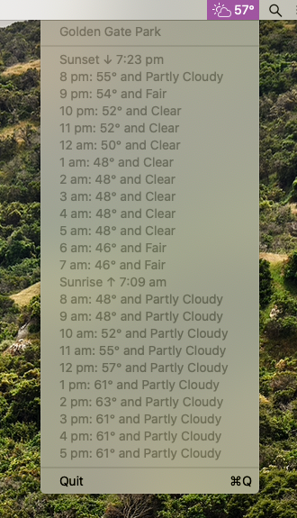

# A macOS Weather Menu Bar App

## How It Used To Work
Combine two parts WeatherKit, one part CoreLocation, and sprinkle on a dash of AppKit. Mix it all together with Xcode, and voila; got yourself an app.

## WeatherKit?
As of macOS Ventura, macOS ships with a public framework, WeatherKit.